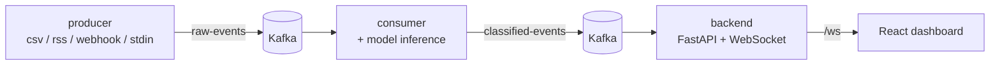

# PulseStream — Real-Time Event Classifier

A real-time ML inference pipeline: events flow through **Kafka**, get classified by a trained model, and stream live to a **React dashboard** over **WebSockets**.

The demo use case is **support-ticket triage** — every incoming message is labelled `bug`, `billing`, `support`, `praise` or `feature_request` with a confidence score, in milliseconds.



## What's in the dashboard

- Live feed with label badge, confidence bar, runner-up guesses, source and per-event latency
- Stat cards: total events, throughput (with sparkline), average confidence, inference latency
- Label distribution — click a label to filter the feed
- Search, minimum-confidence slider, pause / resume, clear
- Automatic WebSocket reconnect (exponential backoff 1s → 15s, "Retry now" button), heartbeat pings
- New visitors instantly see the last events (backend keeps history)
- Model panel: holdout accuracy, macro-F1 and per-class precision/recall
- Dark + light theme (follows your OS), responsive down to phone width, keyboard-accessible

## Project layout

| Path | What it does |
|---|---|
| `config.py` | All settings (Kafka address, topics, paths). Override with env vars, e.g. `KAFKA_BROKER=host:9092` |
| `kafka_utils.py` | Producer/consumer factories that retry until Kafka is reachable |
| `data/build_dataset.py` | Generates `data/tickets.csv` (381 synthetic support tickets, 5 labels) |
| `data/holdout.csv` | 25 hand-written sentences the model never trains on — used for honest evaluation and as the demo stream |
| `model/train.py` | Trains TF-IDF + Logistic Regression (or sentence embeddings with `--backend embeddings`); writes `model/artifacts/classifier.pkl` and `metrics.json` |
| `model/inference.py` | `predict(text)` → `(label, confidence, top-3)` |
| `producer/producer.py` | Pluggable sources: `csv` (default), `rss`, `webhook`, `stdin` |
| `consumer/consumer.py` | `raw-events` → model → `classified-events`; skips malformed messages, reports latency |
| `backend/app.py` | FastAPI: WebSocket `/ws`, REST `/health` `/events` `/stats` `/model`, optional `DEMO_MODE` |
| `frontend/` | React + Vite dashboard |
| `tests/` | `pytest` tests that need no Kafka |
| `Makefile` | Shortcuts for every step below |

## Step-by-step setup

**Prerequisites:** Python 3.10+, Node 18+, Docker Desktop.

### Fastest path — see the dashboard in 3 minutes (no Docker)

```bash
python3 -m venv .venv && source .venv/bin/activate
pip install -r requirements-dev.txt
python3 model/train.py                                  # 1. train the model
DEMO_MODE=1 uvicorn backend.app:app --port 8000         # 2. backend, fake stream (new terminal)
cd frontend && npm install && npm run dev               # 3. dashboard -> http://localhost:5173
```

### Full pipeline with Kafka

1. **Start Kafka** — `docker compose up -d` (wait ~15s; check with `docker compose ps` → healthy)
2. **Python env** — `python3 -m venv .venv && source .venv/bin/activate && pip install -r requirements-dev.txt`
3. **Train the model** — `python3 model/train.py` (prints accuracy/F1, saves the model)
4. **Consumer** (terminal 2) — `python3 consumer/consumer.py`
5. **Backend** (terminal 3) — `uvicorn backend.app:app --reload --port 8000`
6. **Dashboard** (terminal 4) — `cd frontend && npm install && npm run dev` → open http://localhost:5173
7. **Producer** (terminal 5) — `python3 producer/producer.py` → events start flowing

Start order matters a little: consumer and backend read only *new* messages, so start the producer last.
Every service retries if Kafka isn't up yet, so you can't really break it.

### Feeding it real data

```bash
python3 producer/producer.py --rate 5                                   # faster replay
python3 producer/producer.py --source rss --url https://hnrss.org/newest  # live news headlines
python3 producer/producer.py --source webhook --port 9000               # then:
curl -X POST localhost:9000/ticket -H 'content-type: application/json' -d '{"text":"I was charged twice"}'
echo "how do I reset my password" | python3 producer/producer.py --source stdin
```

Note the model only knows the 5 ticket labels, so RSS headlines will be classified with low confidence — the
dashboard flags those as "low". To classify a different domain, replace `data/tickets.csv` (columns `text,label`)
and re-run `python3 model/train.py`.

### Better model (optional)

```bash
pip install -r requirements-embeddings.txt
python3 model/train.py --backend embeddings
```

### Tests

```bash
pytest -q        # or: make test
```

## Results (honest numbers)

| Metric | Value |
|---|---|
| Holdout accuracy (25 unseen sentences) | **84%** |
| Holdout macro-F1 | **0.84** |
| 5-fold CV macro-F1 on the training set | 1.00 — *inflated*: the synthetic training set reuses each sentence with small phrasing changes, so CV leaks. The holdout score is the one to trust. |
| Model-only inference latency | ~1–3 ms per event |

Weakest class is `billing` (recall 0.60). With only 381 synthetic rows, TF-IDF is the ceiling; real tickets and
`--backend embeddings` are the obvious next upgrade.

## Troubleshooting

| Symptom | Fix |
|---|---|
| Dashboard says "Reconnecting…" | Backend isn't running → `uvicorn backend.app:app --port 8000` |
| Backend pill says "Kafka waiting" | `docker compose up -d`; or use `DEMO_MODE=1` |
| Consumer: "No trained model" | `python3 model/train.py` |
| `pip install` fails on `kafka-python` (Python 3.12+) | This repo uses `kafka-python-ng`, which supports 3.12 |
| Port 9092 / 8000 / 5173 in use | Stop the other process, or set `KAFKA_BROKER` / use `--port` / `npm run dev -- --port 5174` |
| Dashboard on another host | Copy `frontend/.env.example` → `frontend/.env.local`, set `VITE_WS_URL`, `VITE_API_URL`; add the origin to `ALLOWED_ORIGINS` |

## Roadmap

- [x] Pick data source + labels (support-ticket triage, 5 classes)
- [x] Real classifier evaluation (holdout set, metrics in dashboard); embeddings backend available
- [x] Pluggable producer (CSV / RSS / webhook / stdin)
- [x] Real dashboard UI
- [x] WebSocket reconnect + error handling (client and Kafka side)
- [x] README with results
- [ ] Replace the synthetic tickets with a real labelled dataset
- [ ] Record a short GIF of the dashboard (`make demo`) and add it above
- [ ] Containerize backend/consumer in `docker-compose.yml`
